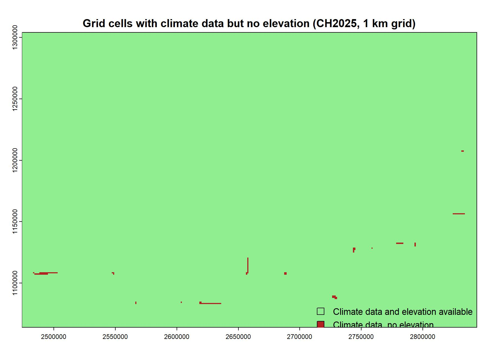

## Context

The summer of 2026 brought exceptional heat and dryness to large parts of Europe, with severe consequences for agriculture, forests, and grasslands. In Switzerland, 2026 was the strongest drought in the ERA5-Land reanalysis record since 1975, and an event of this magnitude would be expected only about twice per 1000 years in a climate without anthropogenic warming [@EuropeanDrought2026]. Meaningful drought projections must therefore look beyond long-term trends in precipitation. Drought impacts arise from the combined effect of several factors: the timing of precipitation events, changes in temperature and incoming solar radiation, and shifts in snow accumulation and snowmelt. These factors are particularly relevant for the response of forests and grasslands to drought. The most recent climate scenarios for Switzerland (CH2025) provide high-resolution projections of the climatic conditions that will shape future droughts. This thesis uses these projections to examine how climate warming alters the frequency and magnitude of drought across Switzerland. By doing so it provides information relevant to forest management, agriculture and water resource management. The resulting drought metrics can also serve as input for studies on forest fire risk and on how droughts affect vegetation productivity and carbon uptake.

## Objective

The aim of this thesis is to analyse the CH2025 climate projections for trends in drought, quantified using the potential cumulative water deficit (PCWD). I hypothesize that (1) the frequency and magnitude of drought events in Switzerland increase with warming, with stronger increases under higher-emission scenarios, and (2) the increase is spatially heterogeneous and strongest in the inner-Alpine dry valleys, followed by the Swiss Plateau, and weakest in the high Alps and the Alpine margins. The results will also be put into context of the drought projections of the Climate CH2025 - Scientific Report @ClimateCH2025Scientific and other research such as @helpapAreModernDroughts2026 and @scherrerTrendsDriversRecent2022.

## Method

### Calculating PCWD

The definition of PCWD as described by @helpapAreModernDroughts2026 is used. Potential cumulative water deficit (PCWD, in mm) is calculated as the cumulative difference between potential evapotranspiration (PET, mm day^-1^) and liquid water infiltration into the root zone (P~in~, mm day^-1^). Following @stockerGlobalPatternsWater2023 and @helpapAreModernDroughts2026, the PCWD is accumulated during events of net water deficit (P~in~ − PET \< 0). An event ends and the sum is reset to zero when the PCWD falls 10 mm below its maximum within that event. The maximum PCWD and the duration (in days) of each event are stored. Also following @helpapAreModernDroughts2026, the Priestley‐Taylor Equation @priestleyAssessmentSurfaceHeat1972 is used to calculate PET, using α = 1.26 as coefficient. The above definitions of PCWD and PET are implemented in the cwd R package for cumulative water deficit calculation @stockerGecobernCwdCwd2026.

### CH2025 Data Structure

The Climate CH2025 datasets comprise daily time series of several meteorological variables at stations (DAILY-LOCAL) and on a high-resolution 1 km grid (DAILY-GRIDDED). DAILY-LOCAL data is structured by stations. Each station has one .csv file covering the full spatial and temporal extent for every GWL and variable. I.e. the CSV file for daily mean temperature at the station Adelboden and GWL1.5 is *ogd-climate-scenarios-ch2025_ABO_tas_GWL1.5.csv.* The .csv file contains the value for that variable and GWL for every simulated day for 30 years (row) and for every Simulation (column). Files are also provided for the model reference period 1991-2020 @ClimateCH2025Datasets. DAILY-GRIDDED data is provided as NetCDF files. Each file covers the full spatial and temporal extent. Files are a combination of a given variable, a given simulation and a given GWL. I.e. the NetCDF File for precipitation with the simulation clmcom-cclm4-cccma is *ogd-climate-scenarios-ch2025-grid_ch_pr_clmcom-cclm4-cccma_gwl1.5.nc.* Files are also provided for the model reference period 1991-2020 @ClimateCH2025Datasets.

Variable provision differs for stations and between DAILY-LOCAL and DAILY-GRIDDED, as is shown in the table below. The reason for the reduced set of variables in DAILY-GRIDDED is "the lack of a gridded observational dataset to serve as reference for the bias correction for the remaining three variables" @ClimateCH2025Datasets.

| Variable name | Unit | DAILY-LOCAL (No. of stations) | DAILY- GRIDDED |
|------------------|------------------|------------------|------------------|
| Daily mean 2m temperature | °C | provided (89) | provided |
| Daily maximum 2m temperature | °C | provided (88) | provided |
| Daily minimum 2m temperature | °C | provided (89) | provided |
| Daily precipitation sum | mm/day | provided (405) | provided |
| Daily mean global radiation | W/m2 | provided (67) | not provided |
| Daily mean relative humidity | \% | provided (88) | not provided |
| Daily mean 10m wind speed | m/s | provided (87) | not provided |

Below is an overview of which variable is available for which station in the DAILY-LOCAL dataset

```{r station-map, echo=FALSE, message=FALSE, warning=FALSE, out.width="100%"}
source(here::here("R", "stations_overview_local.R"), local = knitr::knit_global())
m
```

### Required meteorological variables

The following table indicates, which variables are needed to apply the *cwd* and *pet* function and their source:

| Variable Desc. | required unit | calculation step | source | source name | source unit | source temp. res. |
|-----------|-----------|-----------|-----------|-----------|-----------|-----------|
| Daily precipitation sum | mm | Liquid to soil | CH2025 | pr | mm | daily |
| Snow in liquid water equivalents | mm | Liquid to soil |  | snow | mm |  |
| Daily mean 2m temperature | °C | Liquid to soil, PET | CH2025 | tas | °C | daily |
| Daily mean global radiation | W/m2 | PET | CH2025 | rsds | W/m2 | daily |
| Atmospheric pressure | Pa | PET | standart atmospheric pressure and elevation | patm | \- | \- |
| Elevation a.s.l | m | Atmospheric Pressure | DHM25 | elv | m | \- |

#### Precipitation

Precipitation in mm can be used directly from the CH2025 DAILY-LOCAL and DAILY-GRIDDED data sets.

#### Snow

Snow, as required to calculate liquid to soil, is not available directly from the CH2025 datasets. I apply the same method as @helpapAreModernDroughts2026 to solve this, splitting precipitation into rain (for days with mean temperature \> 1 °C) and snow (for days with mean temperature \< 1 °C). These variables are then fed into *simulate_snow* function of the *cwd* R package.

#### Temperature

Temperature in °C can be used directly from the CH2025 DAILY-LOCAL and DAILY-GRIDDED data sets.

#### Radiation

Radiation in W/m2 can be used directly from the CH2025 DAILY-LOCAL dataset.

#### Atmospheric Pressure

Atmospheric Pressure, as required to calculate PET, is not provided by the CH2025 DAILY-LOCAL and DAILY-GRIDDED data sets. I follow @helpapAreModernDroughts2026 approach, using the standard atmospheric pressure subject to elevation.

#### Elevation

CH2025 DAILY-GRIDDED Data comes is provided on a 1km grid. Metadata indicates that spatial resolution only covers the x and y axis, making it a two dimensional spatial representation. However, to calculate atmospheric pressure, elevation is needed. A raster is created matching the CH2025 DAILY-GRIDDED scale from the digital height model DHM25. DHM25 has a grid size of 200m with altitude interpolated from the landeskarte 1:25000. Since DHM25 doesn't cover the full spatial extent of CH2025 DAILY-GRIDDED, a mismatch results. The mismatch is deemed irrelevant.



### Consolidation

Once all the required variables are available, they will then be consolidated with the following workflow. For DAILY-LOCAL:

1.  For every station, create a dataframe template for final cwd function with date and water balance for the 26 GCM- RCM combinations for GWLs 1.5, 2.0 and 2.5 and the 24 combinations for GWL3.0. I.e. 102 dataframes per station

2.  Add *liquid to soil* column to all dataframes

3.  Calculate liquid to soil by spliting precipitation into snow and rain and using simulate snow function

4.  Add *PET* column to all dataframes

5.  calculate PET using PET function

6.  Calculate water balance: liquid to soil minus evapotranspiration

7.  calculate cwd

### Regional aggregation

With PCWD calculated either on a 1km grid using DAILY-GRIDDED or for DAILY-LOCAL, the results will be aggregated spatially, applying the definition for biogeographic regions as in @ClimateCH2025Scientific.

```{r biogeo-map, echo=FALSE, message=FALSE, warning=FALSE, out.width="100%"}
library(leaflet)

leaflet() |>
  addProviderTiles(providers$Esri.WorldGrayCanvas) |>
  addWMSTiles("https://wms.geo.admin.ch/",
              layers      = "ch.bafu.biogeographische_regionen",
              options     = WMSTileOptions(format = "image/png", transparent = TRUE, opacity = 0.7),
              attribution = "Biogeographical regions: FOEN (BAFU) / geo.admin.ch") |>
  setView(lng = 8.2, lat = 46.8, zoom = 8)
```

## Proof of Concept

## Scope

CH2025 data. no validation or bias correction

No analysis performed on reference data 91-20

wie ist shifts in snow accumulation and snowmelt in pcwd enthalten?

## Timeline

```{r timeline, echo=FALSE, message=FALSE, fig.width=9, fig.height=6.5}
library(tidyverse)

tl <- tribble(
  ~task,                                          ~start,       ~end,         ~type,
  "Drafting proposal",                            "2026-09-26", "2026-10-11", "Phase",
  "Interim meeting",                              "2026-10-08", NA,           "Milestone",
  "Evaluation proposal",                          "2026-10-12", "2026-10-19", "Phase",
  "Discussion proposal",                          "2026-10-20", NA,           "Milestone",
  "Data transformation",                          "2026-10-21", "2026-11-01", "Phase",
  "PCWD calculation",                             "2026-11-02", "2026-11-08", "Phase",
  "Visualisation",                                "2026-11-09", "2026-11-22", "Phase",
  "Ubelix first try",                             "2026-11-23", "2026-12-04", "Phase",
  "Ubelix second try",                            "2026-12-05", "2026-12-09", "Phase",
  "Analyse results",                              "2026-12-10", "2026-12-16", "Phase",
  "Report writing",                               "2026-12-17", "2026-12-26", "Phase",
  "Buffer",                                       "2026-12-27", "2027-01-02", "Phase",
  "Submit draft full paper",                      "2027-01-03", NA,           "Milestone",
  "Evaluation draft full paper",                  "2027-01-04", "2027-01-14", "Phase",
  "Discussion draft full paper",                  "2027-01-15", NA,           "Milestone",
  "Implementing feedback",                        "2027-01-16", "2027-01-28", "Phase",
  "Presentation to GECO group",                   "2027-01-25", NA,           "Milestone",
  "Ubelix",                                       "2027-01-29", "2027-02-04", "Phase",
  "Final submission",                             "2027-02-08", NA,           "Milestone",
  "Deadline grade entry autumn semester 2026 (?)", "2027-02-19", NA,          "Milestone"
) |>
  mutate(start = as.Date(start),
         end   = as.Date(end) + 1,          # include the last day in the bar
         task  = fct_rev(fct_inorder(task)))

ggplot(tl, aes(y = task, colour = type)) +
  geom_segment(data = filter(tl, type == "Phase"),
               aes(x = start, xend = end, yend = task),
               linewidth = 5) +
  geom_point(data = filter(tl, type == "Milestone"),
             aes(x = start), shape = 18, size = 4.5) +
  scale_colour_manual(values = c(Phase = "#2c7fb8", Milestone = "firebrick"),
                      name = NULL) +
  scale_x_date(date_breaks = "1 week", date_labels = "%d %b",
             expand = expansion(add = 3),
             sec.axis = dup_axis()) +
  scale_y_discrete(limits = levels(tl$task),
                 labels = scales::label_wrap(30)) +
  labs(x = NULL, y = NULL) +
  theme_minimal(base_size = 10) +
  theme(panel.grid.minor = element_blank(),
      panel.grid.major.y = element_line(colour = "grey92"),
      axis.text.x.bottom = element_text(angle = 45, hjust = 1),
      axis.text.x.top    = element_text(angle = 45, hjust = 0),
      legend.position = "top")
```

## Bibliography
